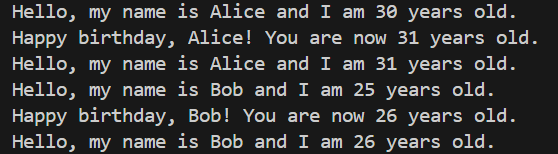

# 第1次隨堂-隨堂-QZ1
>
>學號：112111219
><br />
>姓名：陳恩偉
><br />
>作業撰寫時間：70 (mins，包含程式撰寫時間)
><br />
>最後撰寫文件日期：2023/10/04
>

本份文件包含以下主題：(至少需下面兩項，若是有多者可以自行新增)
- [x] 說明內容
- [x] 個人認為完成作業須具備觀念

## 說明程式與內容
以下程式碼定義一個Person類別，包含名字、年齡兩個屬性，及問候、增加年齡的方法。程式內創建了兩個實例 person1 和 person2，分別代表不同的人，展示了如何使用這些方法來互動且改變實例的狀態。

name:&age:可以準確制訂該容器的分類
函式def可以提升程式的可讀性以及方便後面的維護、修改、使用
```py
class Person:
    name: str
    age: int
    def __init__(self, name: str, age: int):
        self.name = name
        self.age = age
        pass

    def greet(self) -> str:
        return f"Hello, my name is {self.name} and I am {self.age} years old."
        pass
    def haveBirthday(self):
        self.age += 1
        print(f"Happy birthday, {self.name}! You are now {self.age} years old.")
        pass
    pass
# 創建 Person 類的實例
person1 = Person(name="Alice", age=30)
print(person1.greet()) # 輸出：Hello, my name is Alice and I am 30 years old.
person1.haveBirthday() # 輸出：Happy birthday, Alice! You are now 31 years old.
print(person1.greet()) # 輸出：Hello, my name is Alice and I am 31 years old.
# 創建另一個 Person 類的實例
person2 = Person(name="Bob", age=25)
print(person2.greet()) # 輸出：Hello, my name is Bob and I am 25 years old.
person2.haveBirthday() # 輸出：Happy birthday, Bob! You are now 26 years old.
print(person2.greet()) # 輸出：Hello, my name is Bob and I am 26 years old.
```


1. 請參閱投影⽚Topic0_1的第37⾴，並於專案下開啟⼀個1.py的檔案，將該⾴程式
鍵⼊後，請再依照程式內的person1實例，再⽣成⼀個person2，並觀察和
person1的差異

Ans:
個人認為完成作業須具備觀念
理解python基礎語法、屬性、函式用法。
